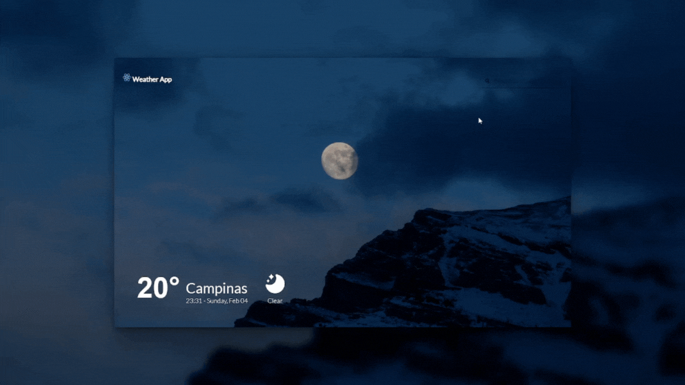

# WeatherApp - Plataforma de Clima em ReactJS ☀️🌧️

## Visão Geral

Bem-vindo ao WeatherApp, um aplicativo em React que fornece informações precisas sobre o clima/tempo em tempo real. Este projeto utiliza a poderosa biblioteca React para criar uma interface intuitiva com um belo design, permitindo que os usuários obtenham facilmente as condições meteorológicas em tempo real.

## Funcionalidades

- **Consulta de Clima/Tempo:** Receba informações detalhadas sobre as condições meteorológicas de qualquer localidade.
- **Consulta em tempo real:** Obtenha dados precisos e atualizados instantaneamente.
- **Pesquisa por Localidade:** Busque por cidade para obter dados precisos da sua localização atual.

## Pré-requisitos

- [Node.js](https://nodejs.org/) (v14.0.0 ou superior)
- [React](https://reactjs.org/) (v17.0.0 ou superior)
- Acesso a Weather API

## Instalação

1. Clone o repositório: `git clone https://github.com/seu-usuario/react-weather-app.git`
2. Navegue até o diretório do projeto: `cd react-weather-app`
3. Instale as dependências: `npm install`

## Configuração da API

1. Obtenha uma chave de API gratuita em [Weather API](https://www.weatherapi.com/).
2. Crie um arquivo `.env` na raiz do projeto.
3. Adicione a chave de API ao arquivo `.env` como `REACT_APP_WEATHER_API_KEY=your_api_key`.

## Uso

1. Inicie o aplicativo: `npm start`
2. Abra o navegador e acesse `http://localhost:3000/`
3. Digite o nome da cidade desejada na barra de pesquisa e obtenha as informações meteorológicas em tempo real.

## Contribuição

Sinta-se à vontade para contribuir para o projeto. Para contribuir, siga estes passos:

1. Fork o repositório
2. Crie uma nova branch: `git checkout -b feature/nova-funcionalidade`
3. Faça as alterações e faça o commit: `git commit -m 'Adiciona nova funcionalidade'`
4. Envie as alterações para o repositório: `git push origin feature/nova-funcionalidade`
5. Abra um Pull Request descrevendo suas alterações.

---

Esperamos que aproveite o ReatherApp! Se tiver alguma dúvida ou sugestão, não hesite em entrar em contato.

**Esteja sempre preparado para qualquer clima com o ReatherApp!**  🌦️
